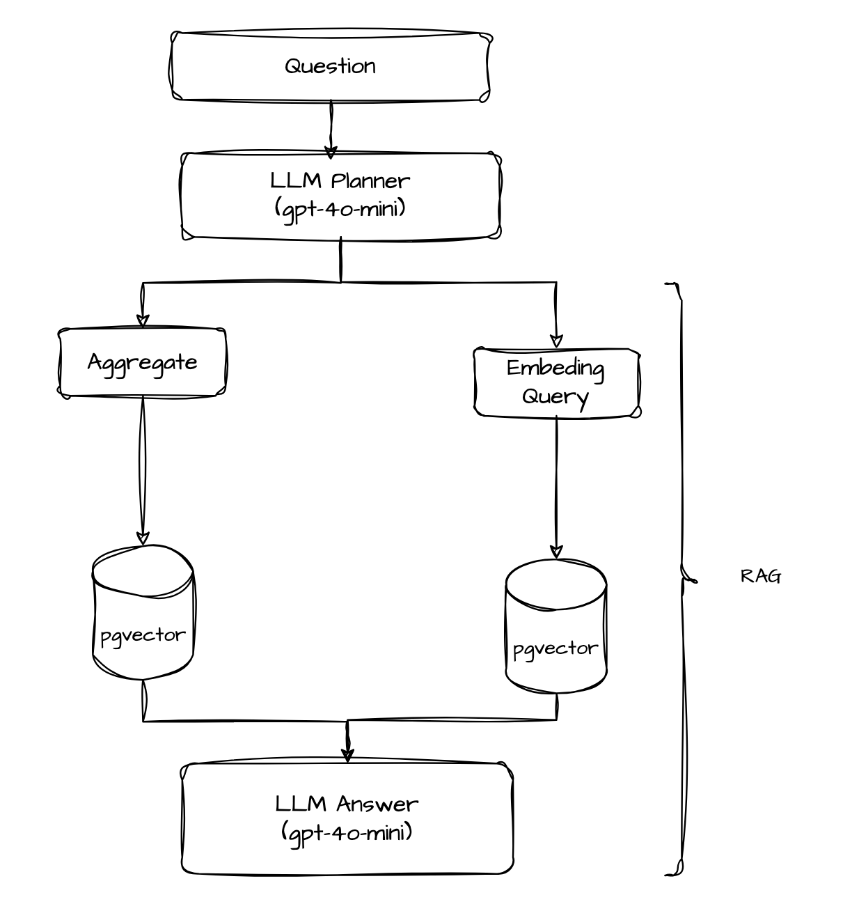

Chapter 1 — Turning logs into vectors: the embedding pipeline

## Why embedding?

For the demo I built for **Tech Hub Conf**, the application was already instrumented: traces in Tempo, logs in Loki, metrics in Prometheus, all visible in Grafana. That answers questions like *"where is the problem?"*, but not another one that comes up often during incidents: *"has something similar happened before?"* or *"was there a database connection error?"*

Keyword search in Loki works when you know exactly what to look for. When the question is conceptual, literal search fails. The solution was to index logs as **semantic vectors** and store them in PostgreSQL with **pgvector**, reusing the application's existing database.

## From log line to vector

The API emits structured logs via an HTTP interceptor. Each request produces a line in this format:

```
http_request method=POST route=/transactions status=201 duration_ms=42
```

The OpenTelemetry Collector forwards those logs to Loki. **Grafana Alloy** collects logs from Docker containers and sends them to Loki as well. From there, the `log-embedder` service takes over — a worker that runs in a loop, independent of the API.

## Incremental polling in Loki

The embedder does not reprocess everything on every cycle. It keeps a **cursor** in nanoseconds in the `log_embedder_cursor` table. On each poll (30 seconds by default), it queries Loki with `query_range` starting from that cursor:

```typescript
const params = new URLSearchParams({
  query: '{source="alloy-otel"}',
  start: cursorNs.toString(),
  end: endNs.toString(),
  limit: '5000',
  direction: 'forward',
});
```

On the first run, with a zero cursor, it performs a lookback (24 hours by default) so history is not lost. After that, it only processes new lines. When a batch finishes, it advances the cursor to `maxNs + 1`, ensuring the same line is never reprocessed.

## Enrichment before embedding

Raw Loki logs are rarely ideal for embedding. The parser extracts useful metadata from each line:

- **service** — service/container name
- **level** — INFO, ERROR, etc.
- **trace_id** — to correlate with traces in Grafana
- **route, http_method, status_code** — parsed from the `http_request` line

Before calling OpenAI, I build an **enriched text** string with context — still human-readable text, not the vector:

```typescript
// Example output from formatEmbedText:
[level=ERROR] [service=app] [POST /transactions] [status=500] [trace_id=abc123...] http_request method=POST route=/transactions status=500 duration_ms=1203
```

Enrichment and embedding are distinct steps: the first produces the metadata string (the `content` field); the second turns that string into the numeric array stored in the `embedding` column. That prefix makes a real difference in semantic search quality. The model can "tell" that the line is a 500 error on a specific POST, not just a generic string.

## Embedding and persistence

I used OpenAI's `text-embedding-3-small` model via LangChain.

In PostgreSQL, the `log_embeddings` table stores both the enriched text and the vector:

```sql
CREATE TABLE log_embeddings (
  id UUID PRIMARY KEY,
  loki_ts TIMESTAMPTZ NOT NULL,
  content TEXT NOT NULL,
  embedding vector(768),
  trace_id TEXT,
  service TEXT,
  level TEXT,
  route TEXT,
  http_method TEXT,
  status_code INT,
  line_hash TEXT UNIQUE
);

CREATE INDEX log_embeddings_embedding_idx
  ON log_embeddings
  USING hnsw (embedding vector_cosine_ops);
```

The **HNSW** (Hierarchical Navigable Small World) index speeds up cosine similarity searches. Without it, every query would do a full scan — fine in my example, but impractical with thousands of lines.

To avoid duplicates when Loki redelivers the same line, I compute a SHA-256 hash combining labels, timestamp, and content. The insert uses `ON CONFLICT (line_hash) DO UPDATE`, updating fields that may have been enriched later (route, status_code).

## What this enables

With logs embedded, two things become possible:

1. **Semantic search** — `GET /logs/search?q=database timeout issue` returns similar lines, even when the original log never contained the word "timeout".
2. **Foundation for Q&A** — in the next chapter, those vectors feed the RAG layer that answers analytical questions.

Keeping everything in PostgreSQL (instead of a dedicated vector DB) was pure convenience, not a deeply researched choice.

---

# Chapter 2 — Natural language questions: LLM Planner, SQL, and RAG

## The endpoint

With embeddings ready, I exposed a `POST /logs/ask` endpoint that accepts a question in natural language and returns an answer based on the logs:

```json
{ "question": "How many failures on the /users endpoint in the last hour?" }
```

The response includes the generated text, the execution plan (for debug/transparency), aggregated metrics when applicable, and the evidence (logs) used to compose the answer.

I could not simply call an LLM here — it would likely hallucinate, invent data, lose its way halfway through, and so on. Context is the key word when working with LLMs, which is why I had to prepare the data carefully before sending it to the model.

## The LLM Planner: three response modes

After receiving the user's question, I send it to the **LLM Planner**, which decides how to answer using three different approaches:

1. **Aggregate** — questions whose answer can be a number alone. Example: *"How many failures on endpoint X?"*
2. **RAG** — more open-ended questions where the answer depends on finding semantically relevant logs. Example: *"Was there a database connection problem?"*
3. **Hybrid** — when you expect numbers **and** details. Example: *"How many calls to endpoint X in the last hour?"*

The response flow looks like this:



The planner uses `gpt-4o-mini` with zero temperature and returns structured JSON:

```json
{
  "mode": "hybrid",
  "timeWindow": { "amount": 1, "unit": "hour" },
  "filters": { "route": "/users", "httpMethod": "GET" },
  "aggregation": "count_http_requests",
  "listLogs": true,
  "limit": 30,
  "ragQuery": "how many GET /users calls in the last hour"
}
```

Important plan fields:

| Field | Purpose |
|-------|---------|
| `timeWindow` | Time range ("last hour", "today", "24 hours") |
| `filters` | Constraints: level, route, httpMethod |
| `aggregation` | SQL count type to execute |
| `listLogs` | Whether to fetch individual logs as evidence |
| `ragQuery` | Reformulated text for semantic search |

If the LLM fails (timeout, invalid JSON), a **heuristic fallback** takes over: regex detects "how many", "which", "was there", infers route and HTTP method from the question, and builds a reasonable plan without relying on the model. Well, if even Anthropic can use regex to spot patterns, so can I!

## Aggregate: SQL answers, the LLM only narrates

In aggregate mode, the numeric answer comes from **direct SQL** on `log_embeddings`.

Three aggregations cover the main cases:

- **`count_failures`** — counts logs with `level = ERROR` or `status_code >= 500`, respecting route/method filters.
- **`top_route_by_count`** — ranking of routes with the most failures in the period.
- **`count_http_requests`** — counts calls to a specific endpoint (e.g. POST `/transactions`).

For *"How many failures on the /users endpoint?"*, the planner generates `mode: aggregate`, `aggregation: count_failures`, `filters: { route: "/users", level: "ERROR" }`. The repository executes:

```sql
SELECT count(*) FROM log_embeddings
WHERE loki_ts >= $1 AND loki_ts < $2
  AND route = '/users'
  AND (level = 'ERROR' OR status_code >= 500)
```

## RAG: semantic search with filters

In RAG mode, the question is embedded with the same model used for indexing, and PostgreSQL performs cosine similarity search:

```sql
SELECT content, 1 - (embedding <=> $1::vector) AS score
FROM log_embeddings
WHERE loki_ts >= $2 AND loki_ts < $3
ORDER BY embedding <=> $1::vector
LIMIT $4
```

The planner's filters (level, route, httpMethod) are applied **before** ordering by score. That prevents a semantically similar log from a different route from appearing in the answer.

Logs with a score below 0.65 are discarded — better to say "I didn't find anything" than to show weak evidence or make things up.

For *"Was there a database connection problem?"*, the planner generates `mode: rag` with no aggregation. Semantic search finds lines with timeout, connection refused, or similar messages, even when the question does not use those exact words.

## Hybrid: number + evidence

Hybrid mode combines aggregate and RAG. It is the most common in practice because real questions rarely ask for only a number or only context.

For *"How many GET /users calls in the last hour?"*:

1. The planner generates `mode: hybrid`, `aggregation: count_http_requests`, `listLogs: true`.
2. SQL counts GET `/users` requests in the period.
3. SQL lists individual logs for that endpoint (prioritizing exact content match, falling back to RAG if needed).
4. The synthesis LLM receives `{ count: 47, evidence: [...] }` and responds: *"There were 47 GET /users calls in the last hour. Examples: [...]"*.

For *"Was a transaction created today?"*, the planner infers `POST /transactions`, counts the calls, and lists logs with status 201, confirming the operation with concrete evidence.

## Synthesis: the LLM delivers the answer, it does not invent data

The last step is the **Answer Service**. It receives the original question, SQL metrics, and up to 20 pieces of evidence, and generates the final answer in natural language.

The system prompt rules are deliberately restrictive:

- Use **only** the numbers present in `metrics`, never invent counts.
- For yes/no questions, confirm or deny based on the evidence.
- INFO logs with 2xx status indicate success (POST 201 = transaction created).
- When the question asks "which" or "was there", list the logs — do not summarize with a bare number.

If the LLM returns an empty or contradictory answer ("there wasn't one" when evidence exists), a **deterministic fallback** formats the response directly from the data, without a model.


## Why separate planner, SQL, and synthesis?

Remember, context is the key word for getting the most out of LLMs. It would be easy — even tempting — to dump all logs into an LLM and let it answer any kind of question, but we know that often does not work. The LLM will hallucinate, blow through the context window, and start giving nonsense answers.

Besides, some questions — or parts of a question — can be answered with SQL, since we already extracted structured metadata from the logs (route, status_code, level) during enrichment in Chapter 1.

Traditional observability answers *"what happened?"*. With embedding + RAG + planner, we can answer more human questions in natural language, with numbers and logs as proof.
