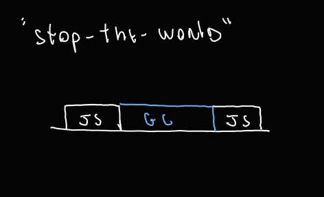
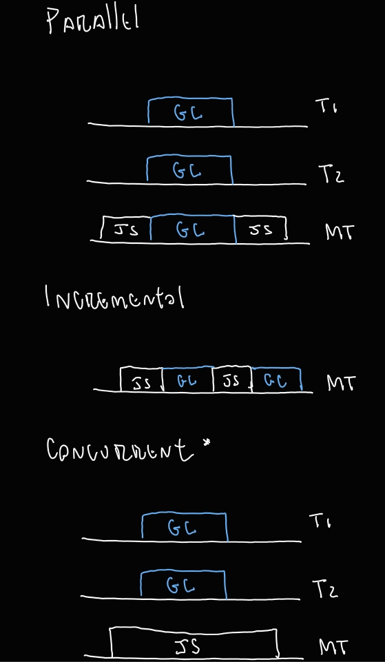
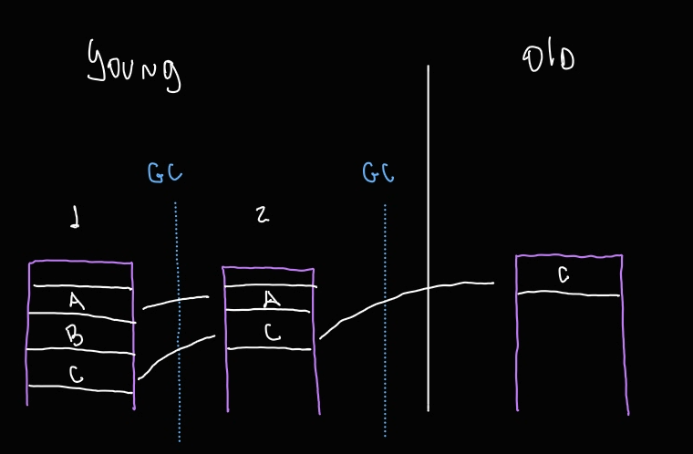
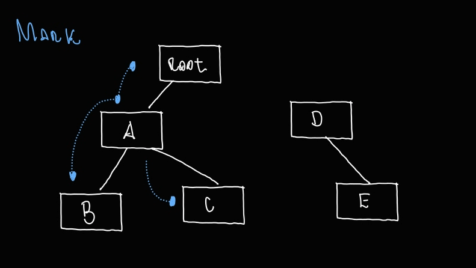
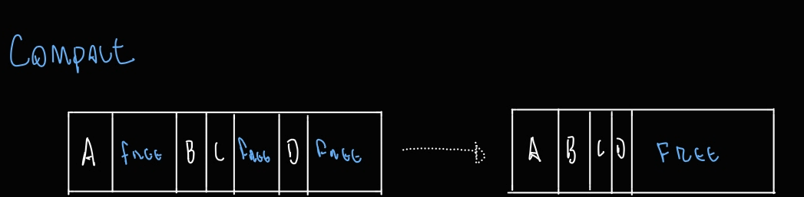
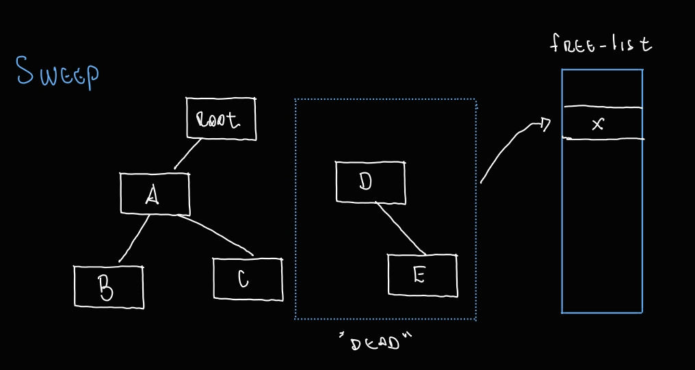

# Introdução

De forma geral, o Garbage collector funciona dessa forma:
1. Identifica objetos "vivos" e "mortos".
2. Recicla/reutiliza a memória ocupada por objetos mortos.
3. Compacta/desfragmenta a memória (opcional).

A definição de objetos vivos e mortos depende do "alcance": em JavaScript, um objeto está vivo se pode ser alcançado a partir da raiz. Esse é um exemplo simples:

```javascript
var novo = {a: 1, b: 2}

console.log(window.novo) //{a: 1, b: 2}
```

Obs.: O caso do *let* e *const* é diferente, por isso existem outras formas de o GC identificar raízes; para esse artigo, vamos considerar o caso do *var*, que é vinculado ao objeto global *window*.


# O custo do GC

Executar o GC vem com um custo: ele consome recursos e, consequentemente, pode aumentar o tempo de processamento. Essa estratégia é chamada de "stop-the-world"; apesar de simples, essa estratégia precisa usar os recursos da main-thread, ou seja, pode causar o aumento de latência.

Atualmente, o V8 suporta outras estratégias de execução do GC, sendo elas:

**Paralela:** Helper threads são criadas para dividir a carga de trabalho por igual entre elas. Essa estratégia ainda causa uma pausa na main-thread, porém, como a carga foi distribuída entre as helper threads, esse tempo tende a ser menor.

**Incremental:** Usa apenas a main-thread, porém o trabalho do GC é dividido durante a execução do programa em cargas menores. Ainda gasta o mesmo tempo que "stop-the-world", porém sem sobrecarregar a main-thread. Na prática, a latência percebida será menor. Imagine um vídeo carregando no YouTube: pequenos engasgos geram um impacto menor no usuário do que um carregamento demorado, mesmo que o tempo total seja o mesmo. Na prática, essa estratégia pode demandar um tempo um pouco maior, dado que alternar o código JS executado pode invalidar a execução do GC.  

**Concorrente:** É quando o código JS é executado na main-thread enquanto o GC é executado em helper threads. À primeira vista, pode parecer a melhor estratégia, porém ela vem com um custo: é a mais complicada porque sofre do mesmo problema da Incremental, porém agora com código JS sendo executado de forma concorrente, ou seja, com operações que podem gerar race conditions.

**Atenção:** A descrição usada pode parecer com a definição de execução paralela, porém, no contexto do GC, como as helper threads estão manipulando o mesmo espaço de memória (heap), entende-se que elas estão concorrendo entre si pelo mesmo recurso; por isso, é concorrência.





# Generation Layout

O V8 divide a heap em duas áreas chamadas generations (gerações), sendo elas a *Young generation* e a *Old generation*. A *Young generation* tem mais duas divisões, *Nursery* e *Intermediate*.

A ideia aqui é que é mais comum criarmos objetos que devem ser destruídos logo na sequência, ou que esse tipo de comportamento é o mais esperado. Por isso, todo objeto nasce na *Young generation*, em *Nursery*; após a primeira rodada do GC, se ele sobreviveu, vai para *Intermediate*; e, após mais uma rodada, se o objeto ainda estiver vivo, vai para *Old generation*. Lembre-se de que estar vivo significa ser acessível através da raiz; no exemplo, ser acessível a partir do objeto global *window*.



## Major GC (Full Mark-Compact)

Considere esse trecho de código:

```javascript

var a = {b: 1, c: 2}
var d = {e: 1}

console.log(window.a) //{b: 1, c: 2} - live object
console.log(window.d) //{e: 1} - live object

d = undefined

console.log(window.a) //{b: 1, c: 2} - live object
console.log(window.d) //undefined - dead object


```

**Marking:** É o processo de acessar os objetos acessíveis e marcá-los. O GC segue os ponteiros e acessa e marca os objetos em tempo de execução de forma recursiva, similar a percorrer uma árvore, até acessar todos os objetos.



**Sweeping:** O espaço ocupado por objetos que não podem ser acessados é adicionado a uma estrutura chamada *free-list*. Essa estrutura organiza os endereços de memória dos espaços liberados e seus tamanhos. Quando houver necessidade de usar mais memória, a *free-list* é consultada para recuperar um espaço livre de acordo com o tamanho desejado.



**Compaction:** É o processo de compactar (e evacuar - mover) a memória usada, em que os objetos vivos são movidos para regiões contínuas. Isso reduz a fragmentação e agrupa o espaço livre, permitindo que ele seja reutilizado em alocações futuras. As regiões livres podem ser registradas na *free-list* e disponibilizadas ao alocador.



O *Major GC* começa de forma *concorrente* no processo de *Marking*; quando termina, envia o resultado para a main-thread, que valida o *Marking* e inicia o *Compact* de forma paralela onde for possível; então, a main-thread começa o *Sweep* de forma *concorrente*.

## Minor GC (Scavenger)

Existem dois tipos de GC no V8: o *Major* é aplicado em toda a heap (*Young* e *Old*), enquanto o *Minor* é aplicado apenas na *Young*.

Esse GC é responsável por mover objetos entre as duas divisões da *Young generation*. Como a *Young generation* é menor, ~16 MB, o Minor GC é executado com mais frequência.

O *Minor GC* usa a estratégia *paralela*, dividindo a carga de trabalho entre a main-thread e as helper threads.


# Analisando o trace do GC na prática

Execute esse código usando a flag *--trace-gc*:
```javascript
//node --trace-gc gc.js
let maximum = 1_000_000;
const entries = new Set();

const main = () => {
  while (maximum > 0) {
    const obj = {
      timestamp: Date.now(),
      index: maximum,
      message: 'memory using'.repeat(100)
    }
    entries.add(obj);
    maximum --;
  }
}
main();
```

A saída será algo assim:

```plain
[55384:0x70480c000]       19 ms: Scavenge 4.4 (5.5) -> 4.2 (6.5) MB, pooled: 0 MB, 0.79 / 0.00 ms  (average mu = 1.000, current mu = 1.000) allocation failure;
```

Vamos entender as partes mais importantes dessa saída:

[55384:0x70480c000] -> [PID: instância da heap JS].
19 ms -> Quando a etapa começou; aqui, significa que começou após 19 ms de execução.
Scavenge -> Fase de execução; nesse caso, Scavenge é Minor GC.
4.4 (5.5) -> Heap usada antes do GC (total da heap antes do GC), ambos em MB.
4.2 (6.5) -> Heap depois do GC (total da heap depois do GC), novamente em MB.
0.79 / ** ms -> Tempo que o JS ficou parado.
allocation failure -> O motivo que disparou o GC: falha de alocação, ou seja, foi necessário alocar um novo objeto, porém a memória estava cheia.

Em outras linhas, podemos ver algo assim:

```plain
[55384:0x70480c000]      297 ms: Mark-Compact 206.7 (318.7) -> 186.0 (315.8) MB, pooled: 0 MB, 70.42 / 0.00 ms  (+ 0.7 ms in 37 steps since start of marking, biggest step 0.1 ms, walltime since start of marking 73 ms) (average mu = 0.755, current mu = 0.755) finalize incremental marking via stack guard; GC in old space requested
```

Note que agora foi executado o Mark-Compact, o Major GC, na *Old generation*, referenciada como old space.

```plain
[55384:0x70480c000]       19 ms: Scavenge 4.4 (5.5) -> 4.2 (6.5) MB, pooled: 0 MB, 0.79 / 0.00 ms  (average mu = 1.000, current mu = 1.000) allocation failure;
[55384:0x70480c000]       20 ms: Scavenge 4.4 (6.5) -> 4.4 (9.0) MB, pooled: 0 MB, 0.62 / 0.00 ms  (average mu = 1.000, current mu = 1.000) allocation failure;
[55384:0x70480c000]       22 ms: Scavenge 6.7 (9.5) -> 6.6 (10.3) MB, pooled: 0 MB, 1.42 / 0.00 ms  (average mu = 1.000, current mu = 1.000) allocation failure;
[55384:0x70480c000]       25 ms: Scavenge 6.9 (10.3) -> 6.8 (15.8) MB, pooled: 0 MB, 2.29 / 0.00 ms  (average mu = 1.000, current mu = 1.000) allocation failure;
[55384:0x70480c000]       29 ms: Scavenge 11.2 (16.4) -> 11.1 (16.4) MB, pooled: 0 MB, 1.71 / 0.00 ms  (average mu = 1.000, current mu = 1.000) allocation failure;
[55384:0x70480c000]       30 ms: Scavenge 11.5 (16.4) -> 11.5 (28.2) MB, pooled: 0 MB, 1.29 / 0.00 ms  (average mu = 1.000, current mu = 1.000) allocation failure;

```


Ao analisar as primeiras linhas do trace, podemos notar que o Scavenge (Minor GC) não consegue limpar a *Young generation*, dado que os valores da heap usada antes e depois do GC são quase iguais:

4.4 -> 42
4.4 -> 4.4
7.6 -> 6.6

Isso ocorre porque o Minor GC não conseguiu se livrar dos novos objetos criados e, olhando para a heap total depois do GC, notamos um aumento gradual.

6.5 MB -> 9.0 MB -> 10.3 MB -> 15.8 MB

Ou seja, os objetos estão sendo promovidos para a *Old generation*, e o Node.js precisa alocar mais recursos para a heap, solicitando-os ao SO.

```plain
[55384:0x70480c000]      297 ms: Mark-Compact 206.7 (318.7) -> 186.0 (315.8) MB, pooled: 0 MB, 70.42 / 0.00 ms  (+ 0.7 ms in 37 steps since start of marking, biggest step 0.1 ms, walltime since start of marking 73 ms) (average mu = 0.755, current mu = 0.755) finalize incremental marking via stack guard; GC in old space requested
```

Em bom português, aqui a vaca foi pro brejo: a quantidade de memória alocada chegou a 315.8 MB, e o Major GC foi acionado.

Agora execute essa versão do código. A diferença aqui é que os objetos são criados e, como não são adicionados ao Set, perdem sua referência; logo, não vão para a *Old generation*. O trace irá mostrar apenas a execução do Minor GC.

```javascript
let maximum = 1_000_000;
const entries = new Set();

const main = () => {
  while (maximum > 0) {
    const obj = {
      timestamp: Date.now(),
      index: maximum,
      message: 'memory using'.repeat(100)
    }
    //entries.add(obj);
    maximum --;
  }
}
main();


```


# Conclusão

Após entender como funciona o GC no Node, podemos ler o trace do GC e procurar por vazamentos de memória. Em alguns casos, manipular o tamanho de cada generation (espaço) pode resolver o problema. Por exemplo, você pode testar a execução do mesmo código com essa flag, que altera o limite da *Young* (referenciado como semi-space).

```bash
node --trace-gc --max-semi-space-size=900 gc.js
```

O resultado esperado é coletas menores do Minor GC e menos execuções do Major GC, dado que agora temos mais espaço total na *Young*.

Em cenários reais, será mais difícil identificar vazamentos de memória, e outras técnicas para analisar a aplicação podem e devem ser usadas; porém, entender o funcionamento do GC e saber como ler o seu trace é parte fundamental para descobrir problemas.

Obs.: Alguns detalhes da *Young* como semi-spaces e writer barriers, foram deixados de fora do artigo para simplifca-lo.


**Uso de IA**:
- Correção gramatical.

**Fontes**:
https://nodejs.org/learn/diagnostics/memory/using-gc-traces
https://v8.dev/blog/trash-talk
https://nodejs.org/api/cli.html
