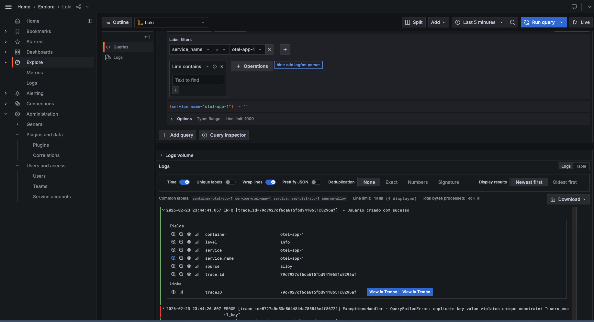
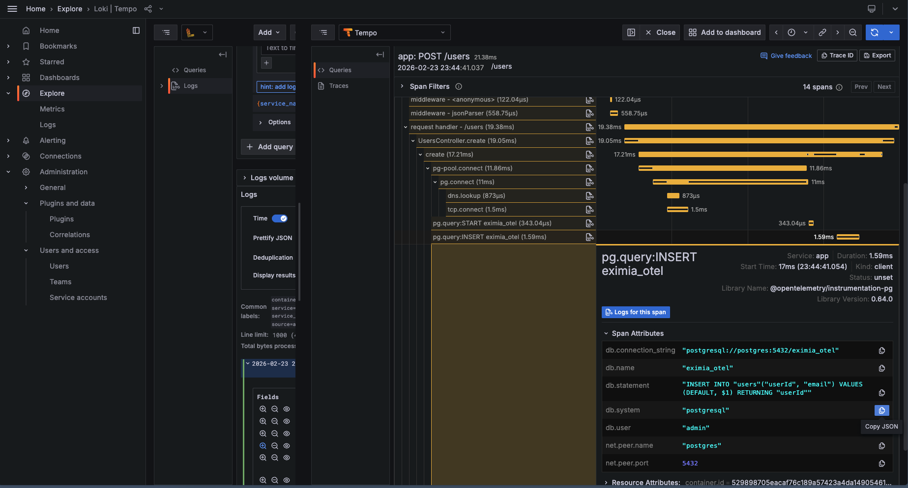
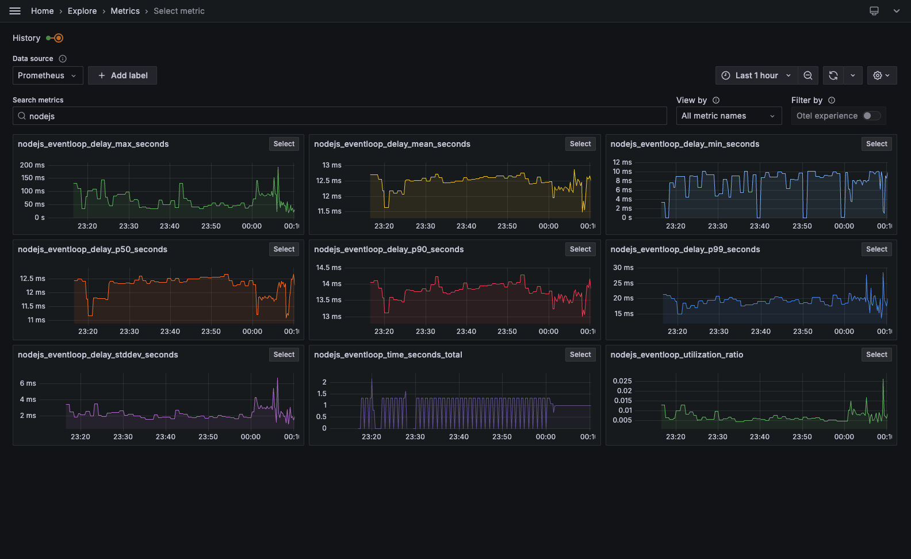

## Introdução

Observabilidade é a capacidade de entender o que está acontecendo dentro de um sistema através dos sinais que ele emite. Em vez de adivinhar por que uma requisição falhou, você pergunta ao sistema. E ele responde.

O problema é que, por padrão, aplicações Node não emitem quase nada de útil. É como voar sem painel de instrumentos: você sabe que está no ar, mas não sabe para onde vai. O que vou mostrar aqui é como montar esse painel, da definição dos três pilares de telemetria até a instrumentação prática com OpenTelemetry.


## Por que observabilidade importa

Com múltiplos serviços, filas assíncronas e _workers_, a pergunta "o que está acontecendo?" deixa de ter uma resposta simples. Sem sinais combinados, você vive em modo "apagar incêndio": cada incidente revela o próximo sintoma, nunca a causa raiz.

Com observabilidade, o time visualiza o fluxo completo, do recebimento da requisição até o processamento em fila, e consegue responder não só "o que falhou?" mas "por que falhou?": a conversa passa de reação para investigação.

## Os três pilares: logs, métricas e traces

Toda telemetria parte de três tipos de sinais, cada um cobrindo um ângulo diferente:

**_Logs_** são mensagens com _timestamp_ emitidas por serviços. Registram eventos pontuais, como a criação de um usuário, uma falha de conexão com o banco ou uma mudança de status. Sozinhos, não rastreiam o fluxo de uma requisição, mas mostram o que aconteceu num momento específico.

**Métricas** são números que evoluem ao longo do tempo: taxa de erro, latência média, uso de CPU, requisições por segundo. Mostram quando algo saiu do padrão, mas não explicam o motivo.

**_Traces_** (rastreamento distribuído) mostram o caminho completo de uma requisição por serviços, bancos de dados e filas. Permitem ver onde o tempo foi gasto e o que causou a falha. Sem precisar reproduzir nada localmente.

## Instrumentação prática com OpenTelemetry

OpenTelemetry (OTel) é o padrão aberto para instrumentação de aplicações. Surgiu para evitar _lock-in_ com fornecedores. Você instrumenta uma vez e troca o _backend_, de Datadog para Grafana, sem reescrever o código da aplicação.

Existem duas formas de instrumentar:

- **_Zero-code_** (auto-instrumentação): Sem modificar o código da aplicação, o OTel já captura _traces_ de _frameworks_ populares como Express, HTTP, pg, amqplib e outros. É o ponto de partida para quem está começando.
- **_Code-based_** (instrumentação manual): Para o que o OTel não captura automaticamente, você cria _spans_ manualmente.

Neste artigo vamos usar a abordagem _zero-code_. As duas abordagens podem ser combinadas.

Para ativar a auto-instrumentação, basta importar o pacote `@opentelemetry/auto-instrumentations-node` como primeira linha do _entrypoint_ da aplicação:

```typescript
import '@opentelemetry/auto-instrumentations-node/register'
import { NestFactory } from '@nestjs/core'
import { AppModule } from './app.module'

async function bootstrap() {
  const app = await NestFactory.create(AppModule)
  await app.listen(process.env.PORT ?? 3001)
}
bootstrap()
```

Com isso, toda requisição HTTP e chamada ao banco geram _spans_ automaticamente. O destino dos dados é configurado via variáveis de ambiente, normalmente no `docker-compose.yml`:

```yaml
environment:
  OTEL_EXPORTER_OTLP_ENDPOINT: http://otel-collector:4318
  OTEL_EXPORTER_OTLP_PROTOCOL: http/protobuf
  OTEL_SERVICE_NAME: app
  OTEL_TRACES_EXPORTER: otlp
  OTEL_METRICS_EXPORTER: otlp
```

## OTel Collector e a stack de observabilidade

A aplicação instrumentada emite sinais, mas quem processa e distribui tudo é a _stack_ de observabilidade. O [OpenTelemetry Collector](https://opentelemetry.io/docs/collector/) é o _hub_ central: recebe os dados em OTLP (OpenTelemetry Protocol) e os distribui para cada _backend_.

Aqui vamos usar a _stack_ do Grafana: ela roda localmente e é fácil de reproduzir.

- **Grafana Tempo**, _backend_ de _traces_. Armazena _spans_ e permite consultas por _trace ID_ e TraceQL.
- **Grafana Loki**, _backend_ de _logs_. Indexa por _labels_ (não pelo conteúdo), otimizado para busca via LogQL.
- **Prometheus**, _backend_ de métricas. Faz _scrape_ do _endpoint_ do Collector (porta 8889) e armazena séries temporais para consultas PromQL.
- **Grafana**, camada de visualização. Conecta-se aos três _backends_ como _datasources_ para explorar e correlacionar sinais.
- **Grafana Alloy**, agente de coleta. Descobre _containers_ Docker e envia os _logs_ de _stdout_/_stderr_ diretamente para o Loki, sem alterar o código da aplicação.

O **Collector** é passivo: recebe o que a aplicação envia via _push_ OTLP. O **Alloy** é ativo: vai buscar _logs_ diretamente nos _containers_. No mesmo projeto, o **Collector** recebe os sinais da aplicação e o **Alloy** captura os _logs_ dos _containers_, cobrindo fontes diferentes de sinais.

O resumo do fluxo por tipo de sinal:

| Sinal         | Origem              | Caminho                              | Backend    |
| ------------- | ------------------- | ------------------------------------ | ---------- |
| Traces        | Auto-instrumentação | App → Collector → Tempo              | Tempo      |
| Métricas      | Auto-instrumentação | App → Collector → :8889 → Prometheus | Prometheus |
| Logs (stdout) | Containers          | Alloy → Loki                         | Loki       |

Essa separação significa que, quando você quiser trocar o provedor, de Grafana Cloud para Datadog, basta mudar a configuração do Collector. A aplicação não precisa saber para onde os dados vão.

## Mão na massa

Clone o repositório do projeto e inicie os serviços:

```bash
docker compose up -d
```

Em seguida, crie um usuário para gerar sinais na aplicação:

```bash
curl --request POST \
  --url http://localhost:3001/users \
  --header 'content-type: application/json' \
  --data '{ "email": "fulano@eximia.co" }'
```

Acesse http://localhost:3000 para abrir o Grafana. Em _Explore_, selecione Loki. Em _Label filters_, selecione `service_name = otel-app1`.



O _log_ **Usuário criado com sucesso** aparece após a requisição de criação. Entre os campos, o mais importante é o `trace_id`: com ele é possível correlacionar o _log_ com o _trace_.

Com _logs_ no Loki e _traces_ no Tempo, você tem dois _backends_ separados. O que conecta os dois é o **_correlation ID_**: um identificador presente nos _logs_ e nos _spans_, que permite ir do _log_ direto para o _trace_ no Grafana.

No OTel, esse identificador já existe: é o `traceId`, gerado e propagado automaticamente. O passo seguinte é garantir que ele apareça também nos _logs_.

Para isso, criamos um _logger_ customizado que captura o _span_ ativo e injeta o `traceId` em cada linha, estendendo o `ConsoleLogger` do NestJS:

```typescript
import { trace } from '@opentelemetry/api'
import { ConsoleLogger } from '@nestjs/common'

function getTraceId(): string {
  const span = trace.getActiveSpan()
  return span?.spanContext().traceId ?? ''
}

export class TraceLogger extends ConsoleLogger {
  formatLine(level: string, message: string, context?: string): string {
    const traceId = getTraceId()
    const ctx = context ?? this.context ?? ''
    const tracePart = traceId ? ` [trace_id=${traceId}]` : ''
    return `${level.toUpperCase()}${tracePart} ${ctx} - ${message}`
  }

  log(message: string, context?: string): void {
    process.stdout.write(this.formatLine('info', message, context) + '\n')
  }

  error(message: string, stack?: string, context?: string): void {
    process.stdout.write(this.formatLine('error', message, context) + '\n')
    if (stack) process.stdout.write(stack + '\n')
  }

  warn(message: string, context?: string): void {
    process.stdout.write(this.formatLine('warn', message, context) + '\n')
  }
}
```

Cada linha de _log_ fica no formato `INFO [trace_id=abc123...] Context - mensagem`. O Alloy extrai o `trace_id` via _regex_ e o promove a _label_ do Loki:

```text
stage.regex {
  expression = "trace_id=(?P<trace_id>[a-f0-9]{32})"
}

stage.labels {
  values = { trace_id = "" }
}
```

Com o `trace_id` como _label_, o Grafana cria um link automático entre o Loki e o Tempo. Para isso, basta configurar um _derived field_ no _datasource_ do Loki:

```yaml
jsonData:
  derivedFields:
    - datasourceUid: tempo
      matcherRegex: 'trace_id=([a-f0-9]{32})'
      name: traceID
      url: '${__value.raw}'
      urlDisplayLabel: View in Tempo
```

Ao abrir um _log_ no Grafana, aparece um link "View in Tempo" que leva direto para o _trace_ completo daquela requisição, sem precisar copiar o ID manualmente.



Note as camadas de _middleware_ do Express e como cada consulta ao banco aparece como um _span_ separado.

Para explorar as métricas, acesse _Metrics_ no Grafana. No _card_ _Select metric_ aparecem os gráficos gerados automaticamente. Separei algumas métricas úteis para acompanhar o comportamento de APIs e do runtime Node:

**HTTP (APIs)**

| Métrica                                              | Uso                                                                                 |
| ---------------------------------------------------- | ----------------------------------------------------------------------------------- |
| http.server.request.duration                         | Latência (_histogram_); base para p50, p95, p99 e SLAs (_Service Level Agreements_) |
| Contagem de _requests_ por http.response.status_code | _Throughput_ e taxa de erro (4xx, 5xx)                                              |
| http.server.request.size / http.server.response.size | Tamanho de _request_/_response_; tráfego e _outliers_                               |

**Runtime Node.js**

| Métrica                                       | Uso                                                                                                  |
| --------------------------------------------- | ---------------------------------------------------------------------------------------------------- |
| process.runtime.nodejs.event_loop.utilization | Uso da _event loop_; valores altos indicam risco de bloqueio                                         |
| process.runtime.nodejs.memory.heap.used       | _Heap_ usado; útil para identificar tendências e vazamentos                                          |
| process.runtime.nodejs.memory.heap.total      | _Heap_ total (contexto para heap.used)                                                               |
| process.runtime.nodejs.memory.external        | Memória fora do _heap_ (_buffers_, C++); picos inesperados podem indicar vazamento de memória nativa |
| process.cpu.utilization                       | Uso de CPU do processo                                                                               |



## Conclusão

Com o OpenTelemetry e alguns _collectors_, a aplicação passa a emitir _logs_, métricas e _traces_ distribuídos sem alterar uma linha do código.

A próxima vez que uma requisição travar, ninguém vai ficar chutando. Você abre sua ferramenta de observabilidade, vai do _log_ para o _trace_ com um clique e corrige a causa, não o sintoma. Observabilidade não resolve _bugs_, mas elimina o tempo gasto na investigação.

Essa estrutura é a base para alertas proativos, SLOs (_Service Level Objectives_) baseados em dados e _dashboards_ que o time de produto também consegue ler. A base já está no lugar: o sistema agora fala. Basta aprender a ouvir.

---

## Referências

- [OpenTelemetry Node.js, Getting Started](https://opentelemetry.io/docs/languages/js/getting-started/nodejs/)
- [OpenTelemetry Collector](https://opentelemetry.io/docs/collector/)
- [Grafana LGTM Stack (Loki, Grafana, Tempo, Mimir)](https://grafana.com/oss/)
- [OTel Semantic Conventions](https://opentelemetry.io/docs/concepts/semantic-conventions/)
